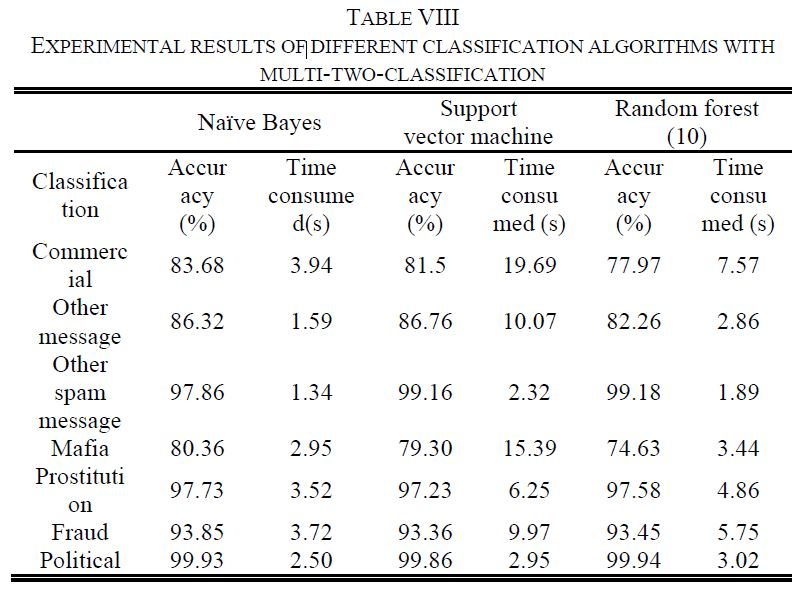

<h1 align="center"> CS4824-ECE4424-Final-Project</h1>

<h1 align="center"> Spam Message Classification Based on the Naive Bayes Classification  
	Written by Bin Ning, Wu JunweI, Hu fengAlgorithm</h1>
		

					
<h1 align="center"> Team member:  
	Chengliang Lu, Hangming He, Yifan Zhou, Xuan Li</h1>

May, 5th, 2019

 
 
## Introduction:

From Spam Message Classification Based on the Naive Bayes Classification Algorithm [1], we trying to reproduce the statement that naive Bayes is a high accurate machine working as a spam filter.  Before the journal demonstrate the statement, they use several critical examples to demonstrate their purpose. For instance, the user for using short message service are increasingly more serious so that the technology of filtering spam messages is significant. Then the journal emphasize the classification is important. The original data set are provided by a mobile operator; the first step is to classifier the original data into seven types which is a text preprocessing. Combination of naïve Bayes algorithm and multi-two-classification would improve the performance. TF-IDF (team frequency-inverse document frequency) algorithm, is a numerical data set that usually help researcher to finish user modelling. The journal also uses Jieba word segmentation to help increase the high accuracy and speed of analysis the Chinese text. In addition, the journal briefly explains the naïve Bayes algorithm which is similar to our class materials. Moreover, the journal expounds how the classification working in their algorithm. The journal also shows the results and a pseudocode of their algorithm.
</a>
Figure 1: The result table form the Spam Message Classification Based on the Naïve Bayes Classification Algorithm [1]
Our team goal here is to demonstrate whether Naive Bayes is faster than svm and random forest.

## Approach:

This journal is about Naive Bayes and Svm Spam Filtering. [2]. The author demonstrate a similar approach to build a naive bayes spam filter as the paper which is the result that we want to approve. First, the author named pablov who write this website use the same step with our journal, preprocess the data, and generate the number of occurrence for each words, and then use multinomial naive bayes classifier to classify the email/sms. The difference is that, in the paper, it will classify into 6 categories and then make a tag, but this code will only classify whether it is spam or ham. 
The author pablov also provide a sample code for us to learn and reproduce the results.
The result after running the code as following:
 
In Large Data Set (5573):

We noticed that the SVM(100% on ham, 87.7% on spam) have higher accuracy than Naive Bayes(100% on ham, 77.7%), which is different from what the paper claims. One possible reason is that the large data set causes the Naive Bayes overfitting, so we take the first 382 data set in the original data set, and the result shows as following:
Small Data Set (382):

This time the accuracy of Naive Bayes(100% on ham, 83.3% on spam) is higher than the SVM(100% on ham, 66.7% on spam), and it is also higher than itself when we run it with large data set.
	
To further prove and investigate the high performance of naive bayes, we compare the performance of naive bayes with SVM and Random Forest. We use the code from the web and run the program with the same dataset to make sure all comparison is based on the same level. The first step to do this is text cleaning where we remove those words from the document which may not contribute to the information we want to extract. A lot of undesirable characters like punctuation, marks, stop words, digit, etc which may not be helpful in detecting the spam email. This step is already included in the program. In addition, lemmatization is another important process. This process is to group together the different inflected forms of a words so they can be analysed as a single item. For example, “give”, “gave” and “given” should all be represented as “give” group. 
	
After text modification, we run the code with training data set, where it comes from our daily emails. Here is our running result. 

 
## Conclusion:

The Naive Bayes has better accuracy in small data set than SVM, and the performance is worse than SVM and Random Forest. In certain situations, for example, if the users don’t want to share their data, and the developer need to train the spam filter model locally, Naive Bayes will be a good choice.  

## Reference:
[1] Bin Ning, Wu Junwei, Hu Feng, “Spam Message Classification Based on the Naïve Bayes Classification Algorithm” IAENG International Journal of Computer Science, 46:1, 2019 http://www.iaeng.org/IJCS/issues_v46/issue_1/IJCS_46_1_05.pdf

[2]: Pablov, “Spam classification with Naive Bayes and Support Vector Machines.¶” https://www.kaggle.com/pablovargas/naive-bayes-svm-spam-filtering/data
